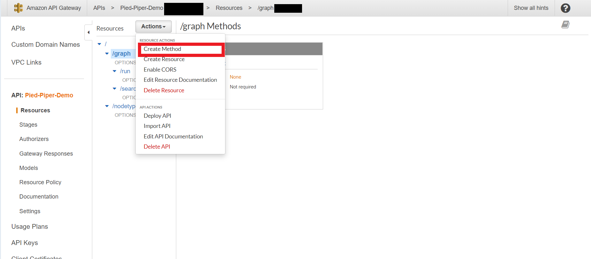

# How to deploy Pied-Piper to AWS-Lambda (Part-2)

This is a second part of the tutorial deploying `Pied-Piper` to `AWS-Lambda` and if you have not uploaded the functions to `AWS-Lambda` please follow the detailed instructions given at https://github.com/alikhan866/pied-piper/blob/master/DEPLOY_LAMBDA.md before getting started with this tutorial.

### Step-1
Log In to the `AWS-Console` and head over to `API-Gateway` and select create API , Then scroll down and select `REST API` and hit `build` as shown below

### Step-2
Configure the `API` as shown below and hit `CreateAPI`

### Step-3
After you `CreateAPI` you will be redirected to `API-Gateway Console` under which select `actions` and under that select `create resource` as shown below

### Step-4
Name the resource as shown and tick `Enable API Gateway CORS`

### Step-5
Enabling `API Gateway CORS` will automatically create an `Options` method for us but it allows all methods by default so we need to navigate inside `Integration Response` and allow only `PUT` for this case

### Step-6
Edit the `Access-Control-Allow-Methods` field as shown under `/graph`

### Step-7
Under `/graph` create two more resources `/run` and `/search` with `API Gateway CORS` enabled, Then edit the `Access-Control-Allow-Methods` of both `/run` and `/search` to allow `POST` as shown below

### Step-8
Then under root create a new resource `/nodetypes` with `API Gateway CORS` enabled, Then edit the `Access-Control-Allow-Methods` of `/nodetypes` to allow `GET` as shown below

### Step-9
Create a new `Method` under `/graph` as shown below

### Step-10
Select the method as `PUT` as shown below 

### Step-11
Under the `PUT` method select the `SaveGraphLambdaFunction` Lambda function which we uploaded to `AWS-Lambda` in the previous tutorial

### Step-12
Follow the same procedures as shown in `Step-9 to Step-11` and create a `POST` method for `/run` and `/search` , Then create a `GET` method for `/nodetypes`, Corresponding Lambda function to use in each method is given below

`/graph` `PUT` : `SaveGraphLambdaFunction`

`/run` `POST` : `ExecuteGraphLambdaFunction`

`/search` `POST` : `SearchGraphLambdaFunction`

`/nodetypes` `GET` : `GetNodesTypesLambdaFunction`

After configuring all the methods our final structure looks like as shown below, After that head over to `Integration Response`

### Step-13
Go to each `Method` and under `Integration Response` edit the `Access-Control-Allow-Methods` to allow 

`PUT` method for `/graph`

`POST` method for `/run` and `/search` 

`GET` method for `/nodetypes`

### Step-14
Go to `Method Response` of each `Method` as shown below

### Step-15

Edit the `Method Response` of each `Method` as given below

### Note 

It is important to configure `API Gateway` exactly as shown in this guide, If you are having problems go through the guide thoroughly, And if still there is some error create an issue about it in Github
