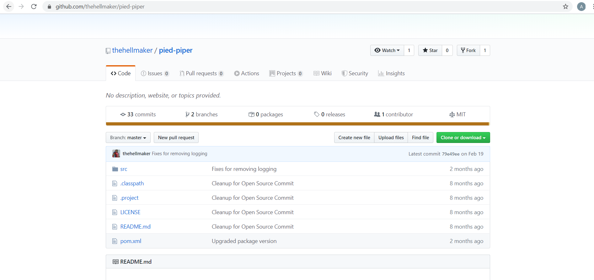
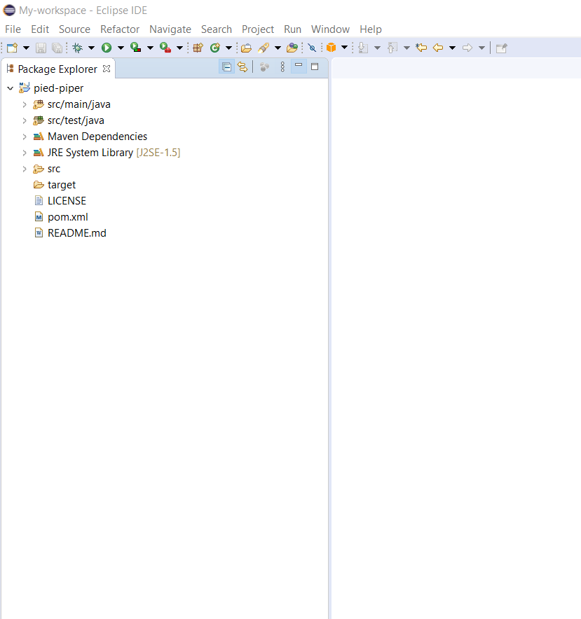
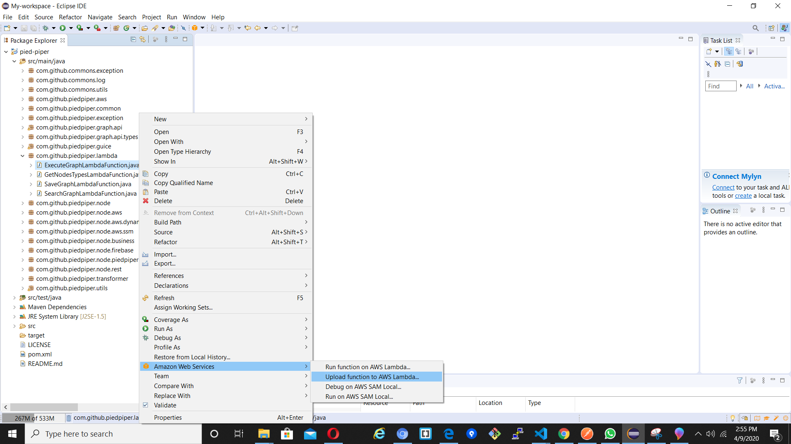
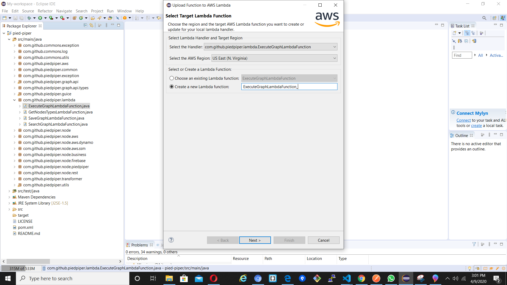
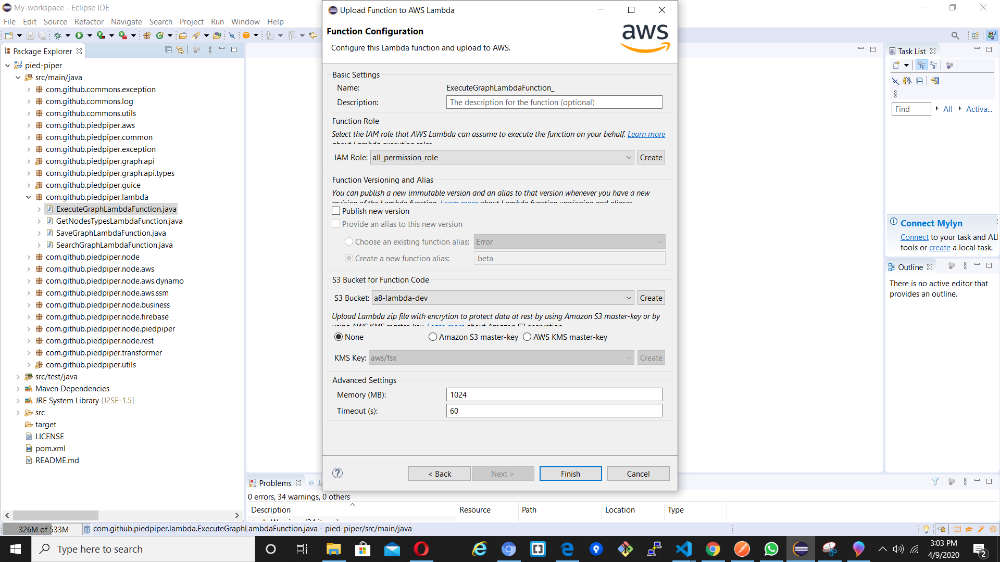

# How to deploy Pied-Piper to AWS-Lambda (Part-1)

### Step-1
Go to https://github.com/thehellmaker/pied-piper and download or clone `Pied-Piper` to your local repository

### Step-2
Open Pied-Piper using `Eclipse-IDE` like shown below which will automatically download all dependencies required for `Pied-Piper`

### Step-3
Install `AWS-toolkit` for `Eclipse-IDE` from the `Eclipse-Marketplace` , Navigate to preferences then, Enter your `Access-Key` and `Secret-Access-key`

After all of the dependencies have been installed successfully navigate to `com.github.piedpiper.lambda` under `src/main/java` and upload function to `AWS-Lambda` like shown below

### Step-4

Select `Handler` according to which function you are uploading and select your `Region`

### Step-5

Select `all_permissions_role` for the lambda function and select a `S3-Bucket` in which you want the code to be stored

#### Note

If you don't have a bucket you can go to the `AWS-Console` and create one

### Step-6

Repeat `Step-4` and `Step-5` for all other functions inside `com.github.piedpiper.lambda` under `src/main/java` 

### Step-7 

We are done with the lambda setup after we upload all the functions to Lambda, Now we need to use API gateway to make calls to our Lambda functions for that follow the guide : 

https://github.com/alikhan866/pied-piper/blob/master/DEPLOY_API_GATEWAY.md
